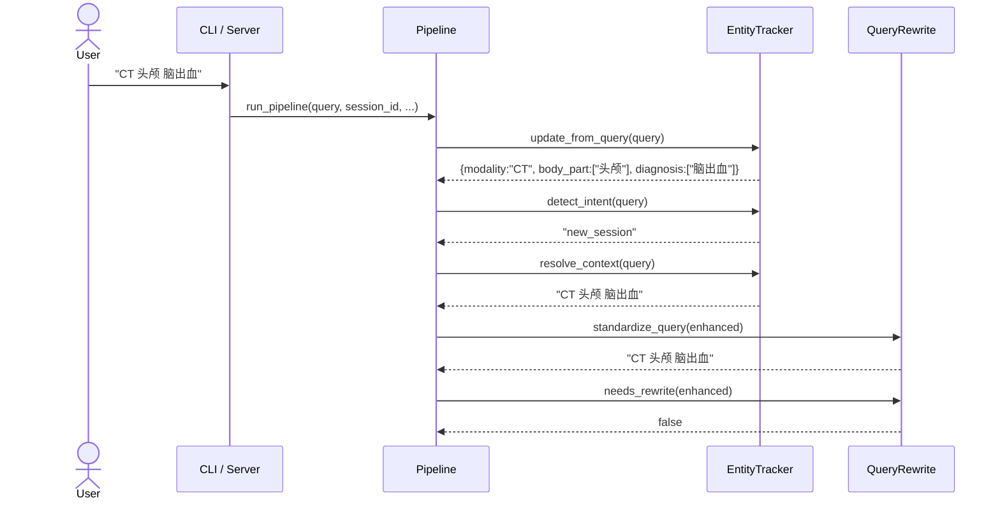

**Phase 1 — 输入处理（Pre-LLM）**

```mermaid
sequenceDiagram
    actor User
    participant CLI as CLI / Server
    participant Pipe as Pipeline
    participant ET as EntityTracker
    participant QR as QueryRewrite

    User->>CLI: "CT 头颅 脑出血"
    CLI->>Pipe: run_pipeline(query, session_id, ...)

    Pipe->>ET: update_from_query(query)
    ET-->>Pipe: {modality:"CT", body_part:["头颅"], diagnosis:["脑出血"]}

    Pipe->>ET: detect_intent(query)
    ET-->>Pipe: "new_session"

    Pipe->>ET: resolve_context(query)
    ET-->>Pipe: "CT 头颅 脑出血"

    Pipe->>QR: standardize_query(enhanced)
    QR-->>Pipe: "CT 头颅 脑出血"

    Pipe->>QR: needs_rewrite(enhanced)
    QR-->>Pipe: false
```
