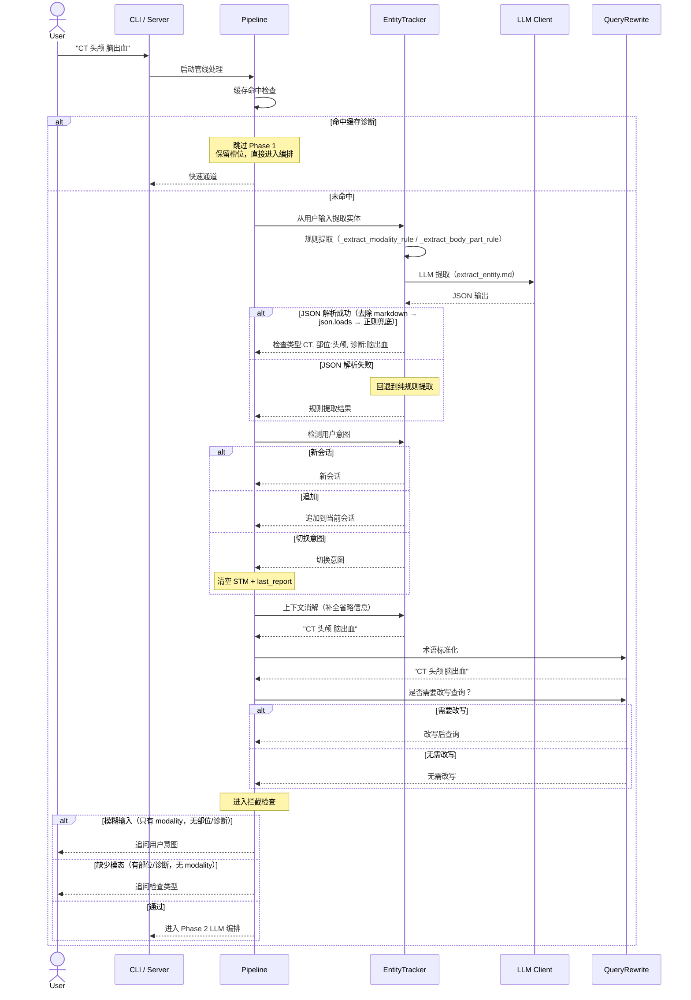

**Phase 1 — 输入处理（实体提取 → 意图检测 → 上下文消解 → 查询改写）**

```mermaid
sequenceDiagram
    actor User
    participant CLI as CLI / Server
    participant Pipe as Pipeline
    participant ET as EntityTracker
    participant LLM as LLM Client
    participant QR as QueryRewrite

    User->>CLI: "CT 头颅 脑出血"
    CLI->>Pipe: 启动管线处理

    Pipe->>Pipe: 缓存命中检查
    alt 命中缓存诊断
        Note over Pipe: 跳过 Phase 1<br/>保留槽位，直接进入编排
        Pipe-->>CLI: 快速通道
    else 未命中
        Pipe->>ET: 从用户输入提取实体
        ET->>ET: 规则提取（_extract_modality_rule / _extract_body_part_rule）
        ET->>LLM: LLM 提取（extract_entity.md）
        LLM-->>ET: JSON 输出
        alt JSON 解析成功（去除 markdown → json.loads → 正则兜底）
            ET-->>Pipe: 检查类型:CT, 部位:头颅, 诊断:脑出血
        else JSON 解析失败
            Note over ET: 回退到纯规则提取
            ET-->>Pipe: 规则提取结果
        end

        Pipe->>ET: 检测用户意图
        alt 新会话
            ET-->>Pipe: 新会话
        else 追加
            ET-->>Pipe: 追加到当前会话
        else 切换意图
            ET-->>Pipe: 切换意图
            Note over Pipe: 清空 STM + last_report
        end

        Pipe->>ET: 上下文消解（补全省略信息）
        ET-->>Pipe: "CT 头颅 脑出血"

        Pipe->>QR: 术语标准化
        QR-->>Pipe: "CT 头颅 脑出血"

        Pipe->>QR: 是否需要改写查询？
        alt 需要改写
            QR-->>Pipe: 改写后查询
        else 无需改写
            QR-->>Pipe: 无需改写
        end

        Note over Pipe: 进入拦截检查

        alt 模糊输入（只有 modality，无部位/诊断）
            Pipe-->>User: 追问用户意图
        else 缺少模态（有部位/诊断，无 modality）
            Pipe-->>User: 追问检查类型
        else 通过
            Pipe-->>CLI: 进入 Phase 2 LLM 编排
        end
    end
```