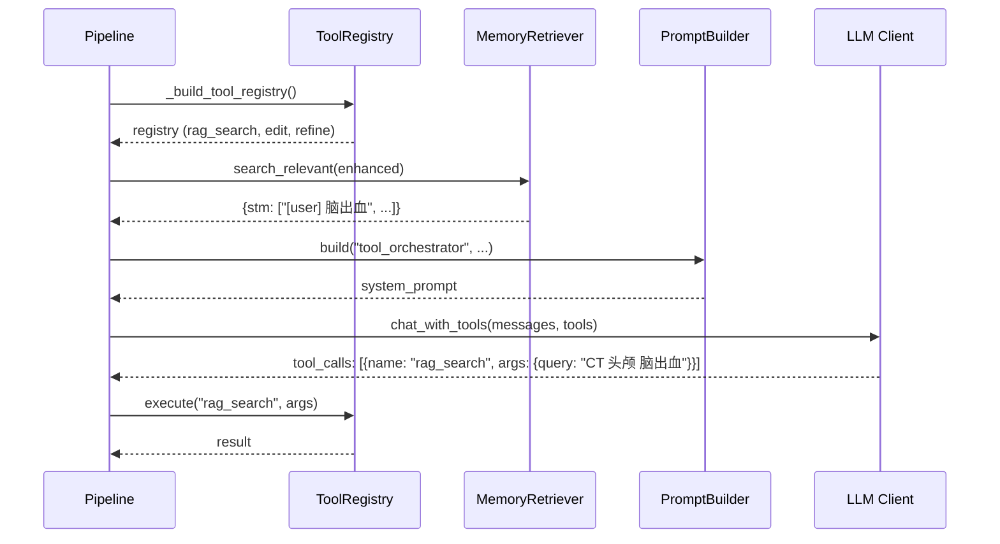

**Phase 2 — LLM 编排决策**

```mermaid
sequenceDiagram
    participant Pipe as Pipeline
    participant TR as ToolRegistry
    participant MR as MemoryRetriever
    participant PB as PromptBuilder
    participant LLM as LLM Client

    Pipe->>TR: _build_tool_registry()
    TR-->>Pipe: registry (rag_search, edit, refine)

    Pipe->>MR: search_relevant(enhanced)
    MR-->>Pipe: {stm: ["[user] 脑出血", ...]}

    Pipe->>PB: build("tool_orchestrator", ...)
    PB-->>Pipe: system_prompt

    Pipe->>LLM: chat_with_tools(messages, tools)
    LLM-->>Pipe: tool_calls: [{name: "rag_search", args: {query: "CT 头颅 脑出血"}}]

    Pipe->>TR: execute("rag_search", args)
    TR-->>Pipe: result
```
