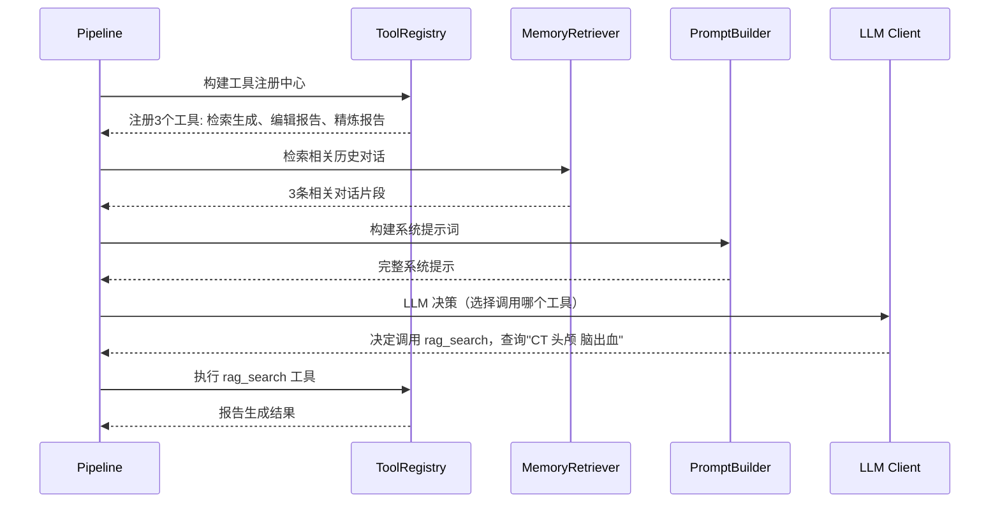

**Phase 2 — LLM 编排决策**

```mermaid
sequenceDiagram
    participant Pipe as Pipeline
    participant TR as ToolRegistry
    participant MR as MemoryRetriever
    participant PB as PromptBuilder
    participant LLM as LLM Client

    Pipe->>TR: 构建工具注册中心
    TR-->>Pipe: 注册3个工具: 检索生成、编辑报告、精炼报告

    Pipe->>MR: 检索相关历史对话
    MR-->>Pipe: 3条相关对话片段

    Pipe->>PB: 构建系统提示词
    PB-->>Pipe: 完整系统提示

    Pipe->>LLM: LLM 决策（选择调用哪个工具）
    LLM-->>Pipe: 决定调用 rag_search，查询"CT 头颅 脑出血"

    Pipe->>TR: 执行 rag_search 工具
    TR-->>Pipe: 报告生成结果
```
