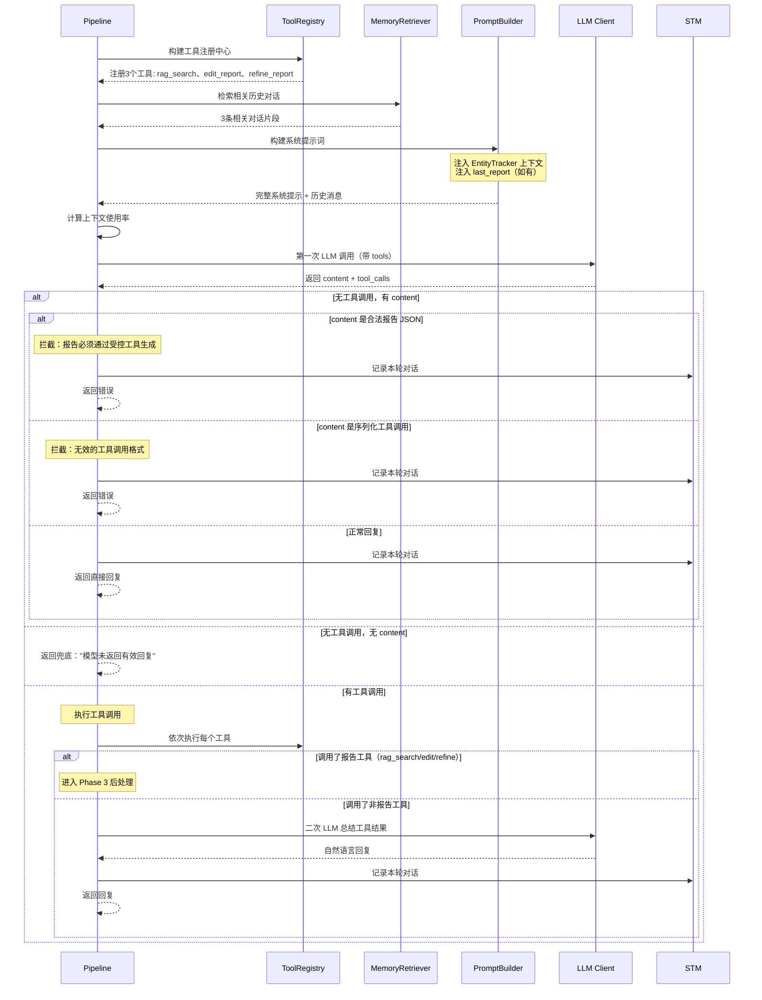

**Phase 2 — LLM 编排决策（工具注册 → 记忆检索 → Prompt 构建 → 决策与调度）**

```mermaid
sequenceDiagram
    participant Pipe as Pipeline
    participant TR as ToolRegistry
    participant MR as MemoryRetriever
    participant PB as PromptBuilder
    participant LLM as LLM Client
    participant STM as STM

    Pipe->>TR: 构建工具注册中心
    TR-->>Pipe: 注册3个工具: rag_search、edit_report、refine_report

    Pipe->>MR: 检索相关历史对话
    MR-->>Pipe: 3条相关对话片段

    Pipe->>PB: 构建系统提示词
    Note over PB: 注入 EntityTracker 上下文<br/>注入 last_report（如有）
    PB-->>Pipe: 完整系统提示 + 历史消息

    Pipe->>Pipe: 计算上下文使用率
    Pipe->>LLM: 第一次 LLM 调用（带 tools）
    LLM-->>Pipe: 返回 content + tool_calls

    alt 无工具调用，有 content
        alt content 是合法报告 JSON
            Note over Pipe: 拦截：报告必须通过受控工具生成
            Pipe->>STM: 记录本轮对话
            Pipe-->>Pipe: 返回错误
        else content 是序列化工具调用
            Note over Pipe: 拦截：无效的工具调用格式
            Pipe->>STM: 记录本轮对话
            Pipe-->>Pipe: 返回错误
        else 正常回复
            Pipe->>STM: 记录本轮对话
            Pipe-->>Pipe: 返回直接回复
        end
    else 无工具调用，无 content
        Pipe-->>Pipe: 返回兜底："模型未返回有效回复"
    else 有工具调用
        Note over Pipe: 执行工具调用
        Pipe->>TR: 依次执行每个工具

        alt 调用了报告工具（rag_search/edit/refine）
            Note over Pipe: 进入 Phase 3 后处理
        else 调用了非报告工具
            Pipe->>LLM: 二次 LLM 总结工具结果
            LLM-->>Pipe: 自然语言回复
            Pipe->>STM: 记录本轮对话
            Pipe-->>Pipe: 返回回复
        end
    end
```