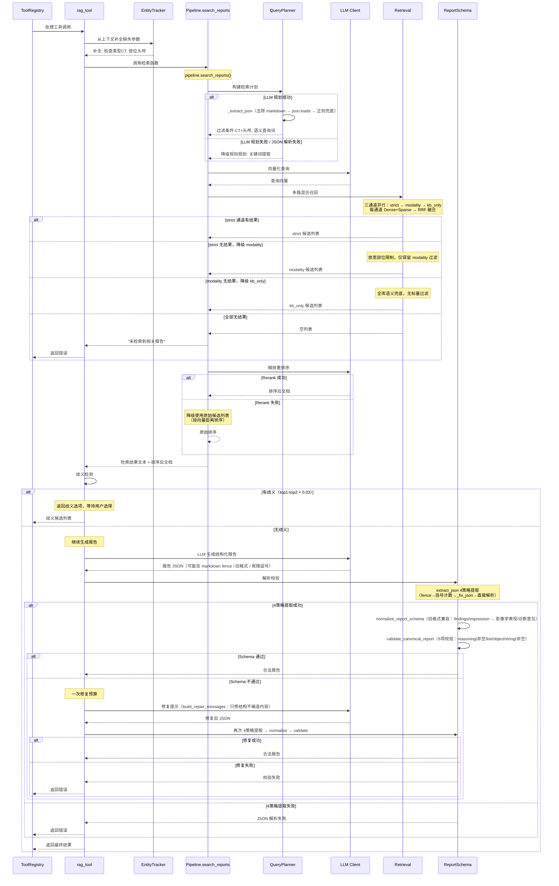

**Phase 2.1 — rag_search 内部检索链路（多路召回 → 重排序 → 报告生成）**

```mermaid
sequenceDiagram
    participant TR as ToolRegistry
    participant RAG as rag_tool
    participant ET as EntityTracker
    participant SR as Pipeline.search_reports
    participant QP as QueryPlanner
    participant LC as LLM Client
    participant RET as Retrieval
    participant RS as ReportSchema

    TR->>RAG: 处理工具调用

    RAG->>ET: 从上下文补全缺失参数
    ET-->>RAG: 补全: 检查类型CT, 部位头颅

    RAG->>SR: 调用检索函数
    Note over SR: pipeline.search_reports()

    SR->>QP: 构建检索计划
    alt LLM 规划成功
        QP->>QP: _extract_json（去除 markdown → json.loads → 正则兜底）
        QP-->>SR: 过滤条件:CT+头颅, 语义查询词
    else LLM 规划失败 / JSON 解析失败
        QP-->>SR: 降级规则规划: 关键词提取
    end

    SR->>LC: 向量化查询
    LC-->>SR: 查询向量

    SR->>RET: 多路混合召回
    Note over RET: 三通道并行：strict → modality → kb_only<br/>每通道 Dense+Sparse → RRF 融合
    alt strict 通道有结果
        RET-->>SR: strict 候选列表
    else strict 无结果，降级 modality
        Note over RET: 放宽部位限制，仅保留 modality 过滤
        RET-->>SR: modality 候选列表
    else modality 无结果，降级 kb_only
        Note over RET: 全库语义兜底，无标量过滤
        RET-->>SR: kb_only 候选列表
    else 全部无结果
        RET-->>SR: 空列表
        SR-->>RAG: "未检索到相关报告"
        RAG-->>TR: 返回错误
    end

    SR->>LC: 精排重排序
    alt Rerank 成功
        LC-->>SR: 排序后文档
    else Rerank 失败
        Note over SR: 降级使用原始候选列表<br/>（按向量距离排序）
        SR-->>SR: 原始排序
    end

    SR-->>RAG: 检索结果文本 + 排序后文档

    RAG->>RAG: 歧义检测
    alt 有歧义（top1-top2 < 0.03）
        Note over RAG: 返回歧义选项，等待用户选择
        RAG-->>TR: 歧义候选列表
    else 无歧义
        Note over RAG: 继续生成报告

        RAG->>LC: LLM 生成结构化报告
        LC-->>RAG: 报告 JSON（可能含 markdown fence / 旧格式 / 尾随逗号）

        RAG->>RS: 解析校验
        Note over RS: extract_json 4策略提取<br/>（fence→括号计数→_fix_json→直接解析）
        alt 4策略提取成功
            RS->>RS: normalize_report_schema（旧格式兼容：findings/impression → 影像学表现/诊断意见）
            RS->>RS: validate_canonical_report（6项校验：reasoning/非空/list/object/string/非空）
            alt Schema 通过
                RS-->>RAG: 合法报告
            else Schema 不通过
                Note over RAG: 一次修复预算
                RAG->>LC: 修复提示（build_repair_messages：只修结构不编造内容）
                LC-->>RAG: 修复后 JSON
                RAG->>RS: 再次 4策略提取 → normalize → validate
                alt 修复成功
                    RS-->>RAG: 合法报告
                else 修复失败
                    RS-->>RAG: 校验失败
                    RAG-->>TR: 返回错误
                end
            end
        else 4策略提取失败
            RS-->>RAG: JSON 解析失败
            RAG-->>TR: 返回错误
        end

        RAG-->>TR: 返回最终结果
    end
```