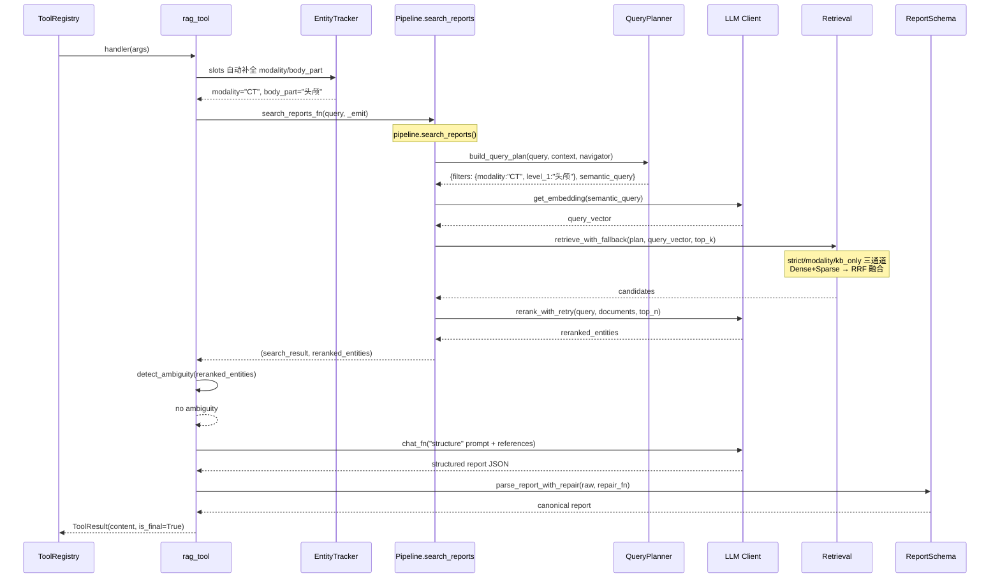

**Phase 2 — rag_search 内部检索链路**

```mermaid
sequenceDiagram
    participant TR as ToolRegistry
    participant RAG as rag_tool
    participant ET as EntityTracker
    participant SR as Pipeline.search_reports
    participant QP as QueryPlanner
    participant LC as LLM Client
    participant RET as Retrieval
    participant RS as ReportSchema

    TR->>RAG: handler(args)

    RAG->>ET: slots 自动补全 modality/body_part
    ET-->>RAG: modality="CT", body_part="头颅"

    RAG->>SR: search_reports_fn(query, _emit)
    Note over SR: pipeline.search_reports()

    SR->>QP: build_query_plan(query, context, navigator)
    QP-->>SR: {filters: {modality:"CT", level_1:"头颅"}, semantic_query}

    SR->>LC: get_embedding(semantic_query)
    LC-->>SR: query_vector

    SR->>RET: retrieve_with_fallback(plan, query_vector, top_k)
    Note over RET: strict/modality/kb_only 三通道<br/>Dense+Sparse → RRF 融合
    RET-->>SR: candidates

    SR->>LC: rerank_with_retry(query, documents, top_n)
    LC-->>SR: reranked_entities

    SR-->>RAG: (search_result, reranked_entities)

    RAG->>RAG: detect_ambiguity(reranked_entities)
    RAG-->>RAG: no ambiguity

    RAG->>LC: chat_fn("structure" prompt + references)
    LC-->>RAG: structured report JSON

    RAG->>RS: parse_report_with_repair(raw, repair_fn)
    RS-->>RAG: canonical report

    RAG-->>TR: ToolResult(content, is_final=True)
```
