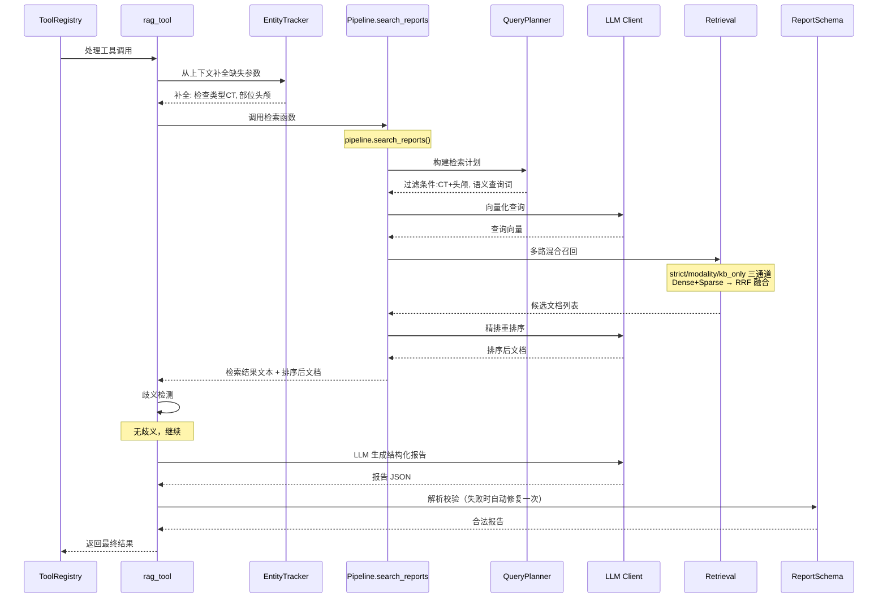

**Phase 2 — rag_search 内部检索链路**

```mermaid
sequenceDiagram
    participant TR as ToolRegistry
    participant RAG as rag_tool
    participant ET as EntityTracker
    participant SR as Pipeline.search_reports
    participant QP as QueryPlanner
    participant LC as LLM Client
    participant RET as Retrieval
    participant RS as ReportSchema

    TR->>RAG: 处理工具调用

    RAG->>ET: 从上下文补全缺失参数
    ET-->>RAG: 补全: 检查类型CT, 部位头颅

    RAG->>SR: 调用检索函数
    Note over SR: pipeline.search_reports()

    SR->>QP: 构建检索计划
    QP-->>SR: 过滤条件:CT+头颅, 语义查询词

    SR->>LC: 向量化查询
    LC-->>SR: 查询向量

    SR->>RET: 多路混合召回
    Note over RET: strict/modality/kb_only 三通道<br/>Dense+Sparse → RRF 融合
    RET-->>SR: 候选文档列表

    SR->>LC: 精排重排序
    LC-->>SR: 排序后文档

    SR-->>RAG: 检索结果文本 + 排序后文档

    RAG->>RAG: 歧义检测
    Note over RAG: 无歧义，继续

    RAG->>LC: LLM 生成结构化报告
    LC-->>RAG: 报告 JSON

    RAG->>RS: 解析校验（失败时自动修复一次）
    RS-->>RAG: 合法报告

    RAG-->>TR: 返回最终结果
```
