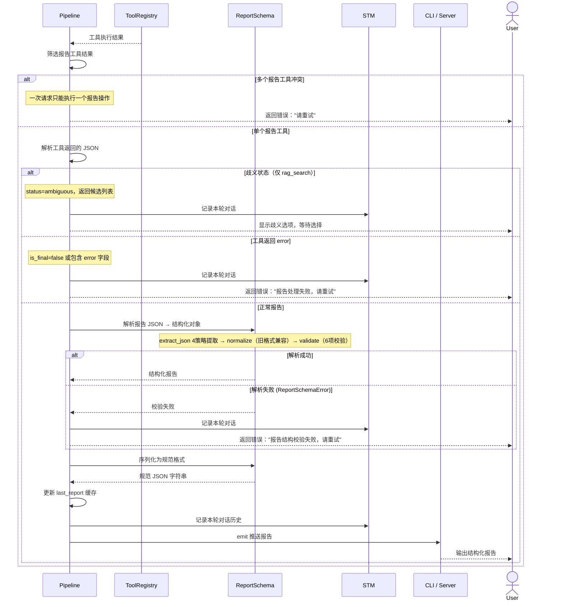

**Phase 3 — 后处理（校验 → 序列化 → 状态更新 → 推送）**

```mermaid
sequenceDiagram
    participant Pipe as Pipeline
    participant TR as ToolRegistry
    participant RS as ReportSchema
    participant STM as STM
    participant CLI as CLI / Server
    actor User

    TR-->>Pipe: 工具执行结果

    Pipe->>Pipe: 筛选报告工具结果

    alt 多个报告工具冲突
        Note over Pipe: 一次请求只能执行一个报告操作
        Pipe-->>User: 返回错误："请重试"
    else 单个报告工具
        Pipe->>Pipe: 解析工具返回的 JSON

        alt 歧义状态（仅 rag_search）
            Note over Pipe: status=ambiguous，返回候选列表
            Pipe->>STM: 记录本轮对话
            Pipe-->>User: 显示歧义选项，等待选择
        else 工具返回 error
            Note over Pipe: is_final=false 或包含 error 字段
            Pipe->>STM: 记录本轮对话
            Pipe-->>User: 返回错误："报告处理失败，请重试"
        else 正常报告
            Pipe->>RS: 解析报告 JSON → 结构化对象
            Note over RS: extract_json 4策略提取 → normalize（旧格式兼容）→ validate（6项校验）
            alt 解析成功
                RS-->>Pipe: 结构化报告
            else 解析失败 (ReportSchemaError)
                RS-->>Pipe: 校验失败
                Pipe->>STM: 记录本轮对话
                Pipe-->>User: 返回错误："报告结构校验失败，请重试"
            end

            Pipe->>RS: 序列化为规范格式
            RS-->>Pipe: 规范 JSON 字符串

            Pipe->>Pipe: 更新 last_report 缓存
            Pipe->>STM: 记录本轮对话历史
            Pipe->>CLI: emit 推送报告
            CLI-->>User: 输出结构化报告
        end
    end
```