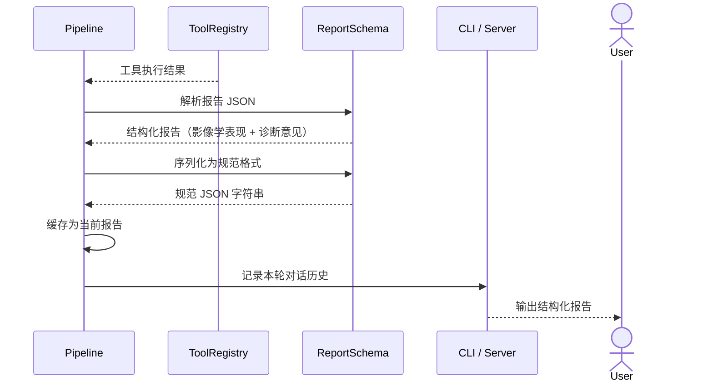

**Phase 3 — 后处理（Post-LLM）**

```mermaid
sequenceDiagram
    participant Pipe as Pipeline
    participant TR as ToolRegistry
    participant RS as ReportSchema
    participant CLI as CLI / Server
    actor User

    TR-->>Pipe: 工具执行结果

    Pipe->>RS: 解析报告 JSON
    RS-->>Pipe: 结构化报告（影像学表现 + 诊断意见）

    Pipe->>RS: 序列化为规范格式
    RS-->>Pipe: 规范 JSON 字符串

    Pipe->>Pipe: 缓存为当前报告
    Pipe->>CLI: 记录本轮对话历史
    CLI-->>User: 输出结构化报告
```
