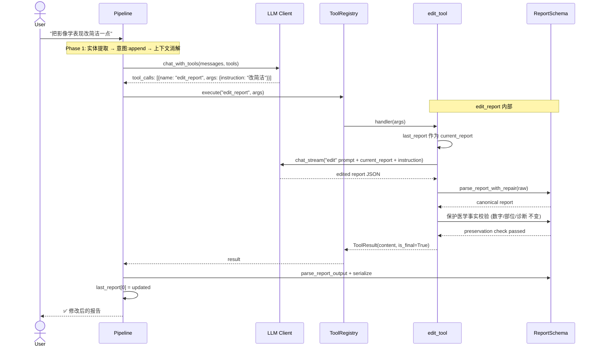

**编辑报告流程（edit_report）**

```mermaid
sequenceDiagram
    actor User
    participant Pipe as Pipeline
    participant LLM as LLM Client
    participant TR as ToolRegistry
    participant Edit as edit_tool
    participant RS as ReportSchema

    User->>Pipe: "把影像学表现改简洁一点"

    Note over Pipe: Phase 1: 实体提取 → 意图:append → 上下文消解

    Pipe->>LLM: chat_with_tools(messages, tools)
    LLM-->>Pipe: tool_calls: [{name: "edit_report", args: {instruction: "改简洁"}}]

    Pipe->>TR: execute("edit_report", args)

    Note over Edit,RS: edit_report 内部

    TR->>Edit: handler(args)
    Edit->>Edit: last_report 作为 current_report

    Edit->>LLM: chat_stream("edit" prompt + current_report + instruction)
    LLM-->>Edit: edited report JSON

    Edit->>RS: parse_report_with_repair(raw)
    RS-->>Edit: canonical report

    Edit->>RS: 保护医学事实校验 (数字/部位/诊断 不变)
    RS-->>Edit: preservation check passed

    Edit-->>TR: ToolResult(content, is_final=True)
    TR-->>Pipe: result

    Pipe->>RS: parse_report_output + serialize
    Pipe->>Pipe: last_report[0] = updated
    Pipe-->>User: ✅ 修改后的报告
```
