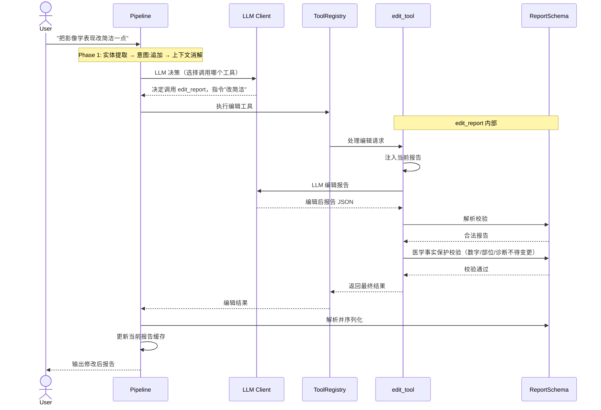

**编辑报告流程（edit_report）**

```mermaid
sequenceDiagram
    actor User
    participant Pipe as Pipeline
    participant LLM as LLM Client
    participant TR as ToolRegistry
    participant Edit as edit_tool
    participant RS as ReportSchema

    User->>Pipe: "把影像学表现改简洁一点"

    Note over Pipe: Phase 1: 实体提取 → 意图:追加 → 上下文消解

    Pipe->>LLM: LLM 决策（选择调用哪个工具）
    LLM-->>Pipe: 决定调用 edit_report，指令"改简洁"

    Pipe->>TR: 执行编辑工具

    Note over Edit,RS: edit_report 内部

    TR->>Edit: 处理编辑请求
    Edit->>Edit: 注入当前报告

    Edit->>LLM: LLM 编辑报告
    LLM-->>Edit: 编辑后报告 JSON

    Edit->>RS: 解析校验
    RS-->>Edit: 合法报告

    Edit->>RS: 医学事实保护校验（数字/部位/诊断不得变更）
    RS-->>Edit: 校验通过

    Edit-->>TR: 返回最终结果
    TR-->>Pipe: 编辑结果

    Pipe->>RS: 解析并序列化
    Pipe->>Pipe: 更新当前报告缓存
    Pipe-->>User: 输出修改后报告
```
