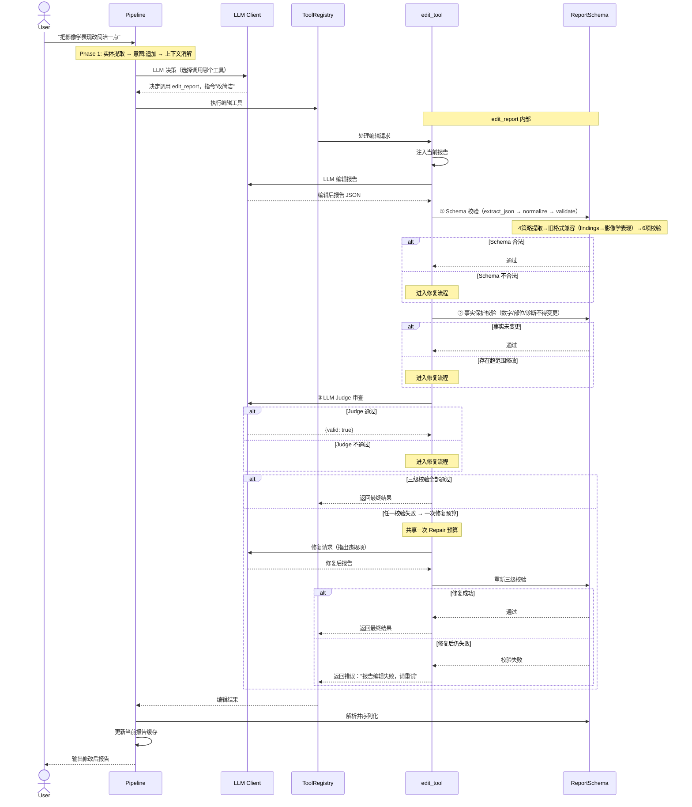

**Phase 2.2 — edit_report 编辑流程（三级校验 → 事实保护 → 修复）**

```mermaid
sequenceDiagram
    actor User
    participant Pipe as Pipeline
    participant LLM as LLM Client
    participant TR as ToolRegistry
    participant Edit as edit_tool
    participant RS as ReportSchema

    User->>Pipe: "把影像学表现改简洁一点"

    Note over Pipe: Phase 1: 实体提取 → 意图:追加 → 上下文消解

    Pipe->>LLM: LLM 决策（选择调用哪个工具）
    LLM-->>Pipe: 决定调用 edit_report，指令"改简洁"

    Pipe->>TR: 执行编辑工具

    Note over Edit,RS: edit_report 内部

    TR->>Edit: 处理编辑请求
    Edit->>Edit: 注入当前报告

    Edit->>LLM: LLM 编辑报告
    LLM-->>Edit: 编辑后报告 JSON

    Edit->>RS: ① Schema 校验（extract_json → normalize → validate）
    Note over RS: 4策略提取→旧格式兼容（findings→影像学表现）→6项校验
    alt Schema 合法
        RS-->>Edit: 通过
    else Schema 不合法
        Note over Edit: 进入修复流程
    end

    Edit->>RS: ② 事实保护校验（数字/部位/诊断不得变更）
    alt 事实未变更
        RS-->>Edit: 通过
    else 存在超范围修改
        Note over Edit: 进入修复流程
    end

    Edit->>LLM: ③ LLM Judge 审查
    alt Judge 通过
        LLM-->>Edit: {valid: true}
    else Judge 不通过
        Note over Edit: 进入修复流程
    end

    alt 三级校验全部通过
        Edit-->>TR: 返回最终结果
    else 任一校验失败 → 一次修复预算
        Note over Edit: 共享一次 Repair 预算
        Edit->>LLM: 修复请求（指出违规项）
        LLM-->>Edit: 修复后报告
        Edit->>RS: 重新三级校验
        alt 修复成功
            RS-->>Edit: 通过
            Edit-->>TR: 返回最终结果
        else 修复后仍失败
            RS-->>Edit: 校验失败
            Edit-->>TR: 返回错误："报告编辑失败，请重试"
        end
    end

    TR-->>Pipe: 编辑结果

    Pipe->>RS: 解析并序列化
    Pipe->>Pipe: 更新当前报告缓存
    Pipe-->>User: 输出修改后报告
```