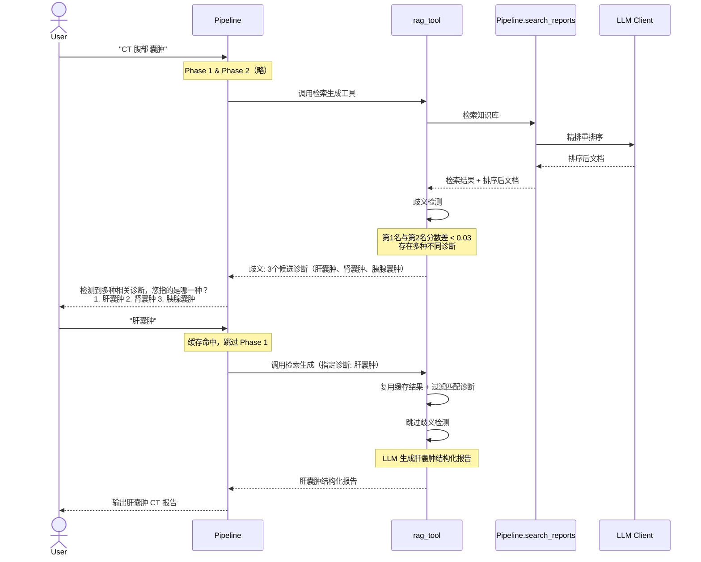

**歧义消解流程（Phase 2 输出 → Phase 3 用户选择）**

```mermaid
sequenceDiagram
    actor User
    participant Pipe as Pipeline
    participant RAG as rag_tool
    participant SR as Pipeline.search_reports
    participant LC as LLM Client

    User->>Pipe: "CT 腹部 囊肿"

    Note over Pipe: Phase 1 & Phase 2（略）

    Pipe->>RAG: 调用检索生成工具

    RAG->>SR: 检索知识库
    SR->>LC: 精排重排序
    LC-->>SR: 排序后文档
    SR-->>RAG: 检索结果 + 排序后文档

    RAG->>RAG: 歧义检测
    Note over RAG: 第1名与第2名分数差 < 0.03<br/>存在多种不同诊断

    RAG-->>Pipe: 歧义: 3个候选诊断（肝囊肿、肾囊肿、胰腺囊肿）

    Pipe-->>User: 检测到多种相关诊断，您指的是哪一种？<br/>1. 肝囊肿  2. 肾囊肿  3. 胰腺囊肿

    User->>Pipe: "肝囊肿"

    Note over Pipe: 缓存命中，跳过 Phase 1

    Pipe->>RAG: 调用检索生成（指定诊断: 肝囊肿）
    RAG->>RAG: 复用缓存结果 + 过滤匹配诊断
    RAG->>RAG: 跳过歧义检测

    Note over RAG: LLM 生成肝囊肿结构化报告

    RAG-->>Pipe: 肝囊肿结构化报告
    Pipe-->>User: 输出肝囊肿 CT 报告
```