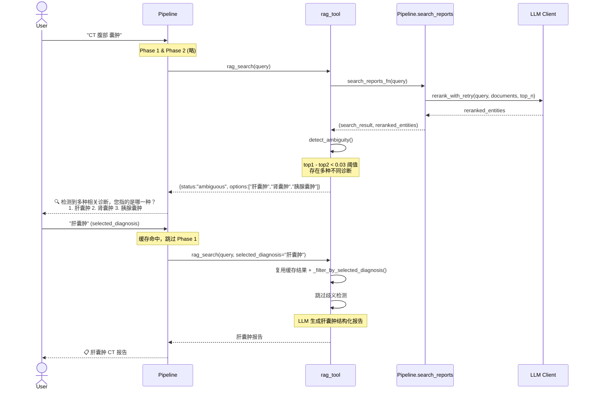

**歧义消解流程**

```mermaid
sequenceDiagram
    actor User
    participant Pipe as Pipeline
    participant RAG as rag_tool
    participant SR as Pipeline.search_reports
    participant LC as LLM Client

    User->>Pipe: "CT 腹部 囊肿"

    Note over Pipe: Phase 1 & Phase 2 (略)

    Pipe->>RAG: rag_search(query)

    RAG->>SR: search_reports_fn(query)
    SR->>LC: rerank_with_retry(query, documents, top_n)
    LC-->>SR: reranked_entities
    SR-->>RAG: (search_result, reranked_entities)

    RAG->>RAG: detect_ambiguity()
    Note over RAG: top1 - top2 < 0.03 阈值<br/>存在多种不同诊断

    RAG-->>Pipe: {status:"ambiguous", options:["肝囊肿","肾囊肿","胰腺囊肿"]}

    Pipe-->>User: 🔍 检测到多种相关诊断，您指的是哪一种？<br/>1. 肝囊肿  2. 肾囊肿  3. 胰腺囊肿

    User->>Pipe: "肝囊肿" (selected_diagnosis)

    Note over Pipe: 缓存命中，跳过 Phase 1

    Pipe->>RAG: rag_search(query, selected_diagnosis="肝囊肿")
    RAG->>RAG: 复用缓存结果 + _filter_by_selected_diagnosis()
    RAG->>RAG: 跳过歧义检测

    Note over RAG: LLM 生成肝囊肿结构化报告

    RAG-->>Pipe: 肝囊肿报告
    Pipe-->>User: 📋 肝囊肿 CT 报告
```
