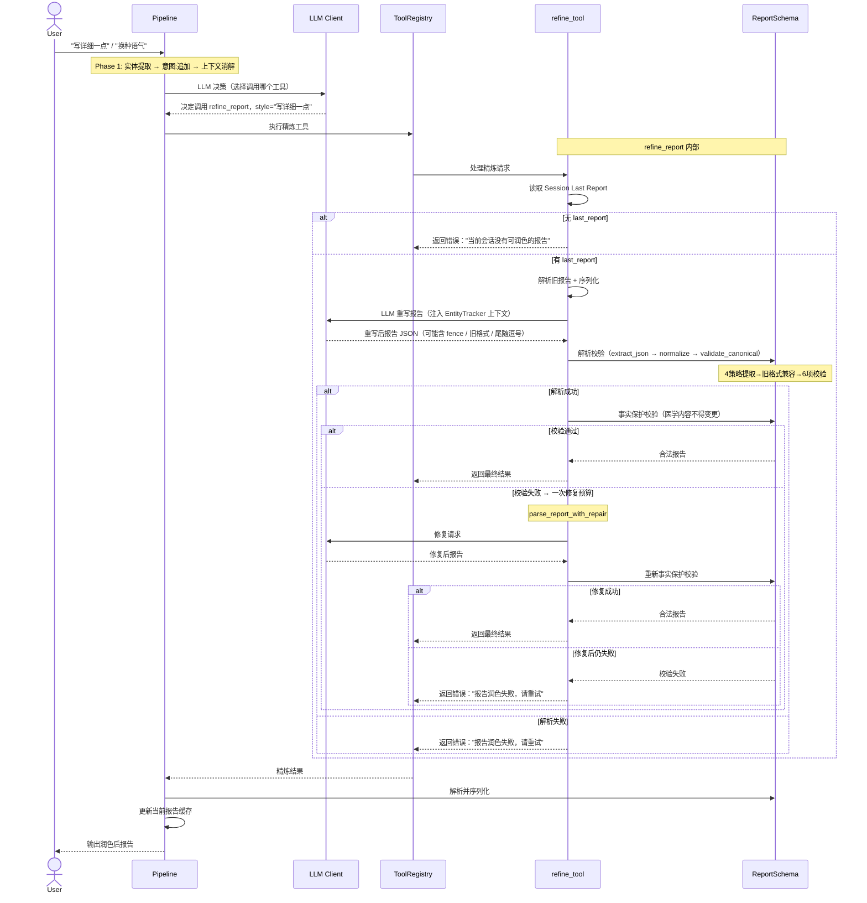

**Phase 2.3 — refine_report 精炼流程（LLM 重写 → 风格调整 → 事实保护）**

```mermaid
sequenceDiagram
    actor User
    participant Pipe as Pipeline
    participant LLM as LLM Client
    participant TR as ToolRegistry
    participant Refine as refine_tool
    participant RS as ReportSchema

    User->>Pipe: "写详细一点" / "换种语气"

    Note over Pipe: Phase 1: 实体提取 → 意图:追加 → 上下文消解

    Pipe->>LLM: LLM 决策（选择调用哪个工具）
    LLM-->>Pipe: 决定调用 refine_report，style="写详细一点"

    Pipe->>TR: 执行精炼工具

    Note over Refine,RS: refine_report 内部

    TR->>Refine: 处理精炼请求
    Refine->>Refine: 读取 Session Last Report
    alt 无 last_report
        Refine-->>TR: 返回错误："当前会话没有可润色的报告"
    else 有 last_report
        Refine->>Refine: 解析旧报告 + 序列化

        Refine->>LLM: LLM 重写报告（注入 EntityTracker 上下文）
        LLM-->>Refine: 重写后报告 JSON（可能含 fence / 旧格式 / 尾随逗号）

        Refine->>RS: 解析校验（extract_json → normalize → validate_canonical）
        Note over RS: 4策略提取→旧格式兼容→6项校验

        alt 解析成功
            Refine->>RS: 事实保护校验（医学内容不得变更）
            alt 校验通过
                RS-->>Refine: 合法报告
                Refine-->>TR: 返回最终结果
            else 校验失败 → 一次修复预算
                Note over Refine: parse_report_with_repair
                Refine->>LLM: 修复请求
                LLM-->>Refine: 修复后报告
                Refine->>RS: 重新事实保护校验
                alt 修复成功
                    RS-->>Refine: 合法报告
                    Refine-->>TR: 返回最终结果
                else 修复后仍失败
                    RS-->>Refine: 校验失败
                    Refine-->>TR: 返回错误："报告润色失败，请重试"
                end
            end
        else 解析失败
            Refine-->>TR: 返回错误："报告润色失败，请重试"
        end
    end

    TR-->>Pipe: 精炼结果

    Pipe->>RS: 解析并序列化
    Pipe->>Pipe: 更新当前报告缓存
    Pipe-->>User: 输出润色后报告
```