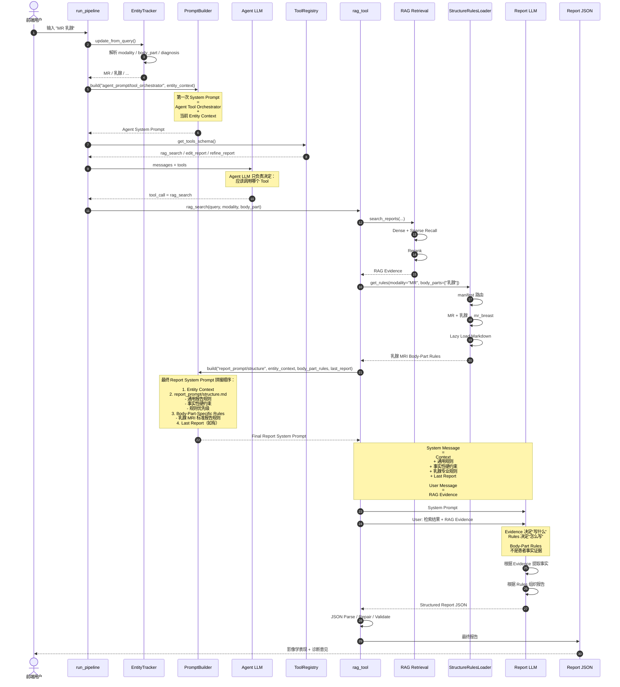

```mermaid
sequenceDiagram
    autonumber

    actor U as 前端用户
    participant P as run_pipeline
    participant ET as EntityTracker
    participant PB as PromptBuilder
    participant L1 as Agent LLM
    participant REG as ToolRegistry
    participant RT as rag_tool
    participant RAG as RAG Retrieval
    participant RL as StructureRulesLoader
    participant L2 as Report LLM
    participant OUT as Report JSON

    %% =========================
    %% 第一阶段：Agent Prompt
    %% =========================
    U->>P: 输入 "MR 乳腺"

    P->>ET: update_from_query()
    ET->>ET: 解析 modality / body_part / diagnosis
    ET-->>P: MR / 乳腺 / ...

    P->>PB: build("agent_prompt/tool_orchestrator", entity_context)

    Note over PB: 第一次 System Prompt<br/>=<br/>Agent Tool Orchestrator<br/>+<br/>当前 Entity Context

    PB-->>P: Agent System Prompt

    P->>REG: get_tools_schema()
    REG-->>P: rag_search / edit_report / refine_report

    P->>L1: messages + tools

    Note over L1: Agent LLM 只负责决定：<br/>应该调用哪个 Tool

    L1-->>P: tool_call = rag_search

    %% =========================
    %% 第二阶段：RAG Tool
    %% =========================
    P->>RT: rag_search(query, modality, body_part)

    RT->>RAG: search_reports(...)
    RAG->>RAG: Dense + Sparse Recall
    RAG->>RAG: Rerank
    RAG-->>RT: RAG Evidence

    %% =========================
    %% 第三阶段：规则加载
    %% =========================
    RT->>RL: get_rules(modality="MR", body_parts=["乳腺"])

    RL->>RL: manifest 路由
    RL->>RL: MR + 乳腺 → mr_breast
    RL->>RL: Lazy Load Markdown

    RL-->>RT: 乳腺 MRI Body-Part Rules

    %% =========================
    %% 第四阶段：报告 Prompt 拼接
    %% =========================
    RT->>PB: build("report_prompt/structure", entity_context, body_part_rules, last_report)

    Note over PB: 最终 Report System Prompt 拼接顺序：<br/><br/>1. Entity Context<br/>2. report_prompt/structure.md<br/>   - 通用报告规则<br/>   - 事实性硬约束<br/>   - 规则优先级<br/>3. Body-Part-Specific Rules<br/>   - 乳腺 MRI 标准报告规则<br/>4. Last Report（如有）

    PB-->>RT: Final Report System Prompt

    %% =========================
    %% 第五阶段：最终 LLM 生成
    %% =========================
    Note over RT,L2: System Message<br/>=<br/>Context<br/>+ 通用规则<br/>+ 事实性硬约束<br/>+ 乳腺专业规则<br/>+ Last Report<br/><br/>User Message<br/>=<br/>RAG Evidence

    RT->>L2: System Prompt
    RT->>L2: User: 检索结果 + RAG Evidence

    Note over L2: Evidence 决定“写什么”<br/>Rules 决定“怎么写”<br/><br/>Body-Part Rules<br/>不是患者事实证据

    L2->>L2: 根据 Evidence 提取事实
    L2->>L2: 根据 Rules 组织报告
    L2-->>RT: Structured Report JSON

    RT->>RT: JSON Parse / Repair / Validate
    RT->>OUT: 最终报告
    OUT-->>U: 影像学表现 + 诊断意见
```